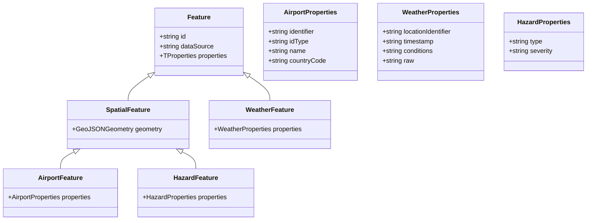
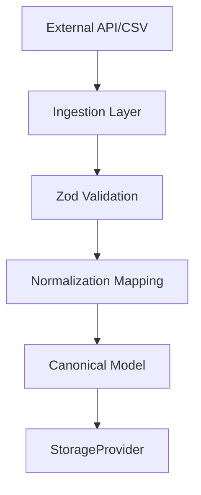

# SkyPath Sentinel: Canonical Data Models

This document defines the internal, canonical data structures for SkyPath Sentinel. These models are designed to be **universal** and **extensible**, ensuring that data from disparate sources (NOAA, FAA, Eurocontrol, OurAirports) can be normalized into a single, type-safe format for geospatial analysis.

---

## 1. Design Principles

*   **Normalization:** All external data (CSV, XML, proprietary JSON) must be mapped to these canonical models during ingestion.
*   **GeoJSON-First:** All spatial data is represented using GeoJSON standards to ensure compatibility with geospatial analysis libraries (e.g., `@turf/turf`).
*   **Polymorphic Identification:** Identifiers are not assumed to be ICAO codes; they are structured as `identifier` + `idType` pairs.
*   **Source Tracking:** Every model includes a `dataSource` field to allow for provenance tracking and debugging.
*   **Type-Safe Hierarchy:**
    *   `Feature<TProperties>`: Base interface for descriptive data.
    *   `SpatialFeature<TProperties, TGeometry>`: Extends `Feature` for data with required geometry.

### 1.1 Geometry Types
To ensure strict GeoJSON compliance and compatibility with geospatial libraries (e.g., `@turf/turf`), we use the standard `GeoJSON` types from `@types/geojson`.

```typescript
import { Point, Polygon, LineString, Geometry } from 'geojson';

export type PointGeometry = Point;
export type PolygonGeometry = Polygon;
export type LineStringGeometry = LineString;

export type GeoJSONGeometry = Geometry;
```

---

## 2. Canonical Models

### 2.1 Airport
Represents a physical aviation facility.

```typescript
export interface AirportProperties {
  identifier: string;    // e.g., 'KJFK'
  idType: 'ICAO' | 'FAA' | 'IATA' | 'LOCAL';
  name: string;
  countryCode: string;   // ISO 3166-1 alpha-2
}
export type AirportFeature = SpatialFeature<AirportProperties, PointGeometry>;
```

### 2.2 Weather
Represents meteorological conditions at a specific location.

```typescript
export interface WeatherProperties {
  locationIdentifier: string; // Primary ID (e.g., ICAO)
  timestamp: string;          // ISO 8601
  conditions: 'VFR' | 'IFR' | 'LIFR' | 'UNKNOWN'; // Canonical classification
  raw: string;                // Original raw report (for auditability)
}
export type WeatherFeature = Feature<WeatherProperties>;
```

### 2.3 Hazard
Represents any constraint on flight operations (NOTAMs, Airspace, Weather Hazards).

```typescript
export interface HazardProperties {
  type: 'WEATHER' | 'AIRSPACE' | 'NOTAM' | 'TERRAIN';
  severity: 'LOW' | 'MEDIUM' | 'HIGH' | 'CRITICAL';
}
export type HazardFeature = SpatialFeature<HazardProperties, PolygonGeometry>;
```

---

## 3. Data Architecture Diagrams

### 3.1 Type Hierarchy


### 3.2 Data Ingestion Flow


---

## 4. Mapping Strategy

The ingestion layer (`DataPopulator` and `DataFetcher` implementations) is responsible for the transformation logic:

1.  **Fetch:** Retrieve raw data from the external source.
2.  **Validate:** Use `Zod` schemas to ensure the raw data meets minimum requirements.
3.  **Normalize:** Map external fields to the canonical model fields.
4.  **Store:** Save the normalized model (and optionally the raw data) to the `StorageProvider`.
